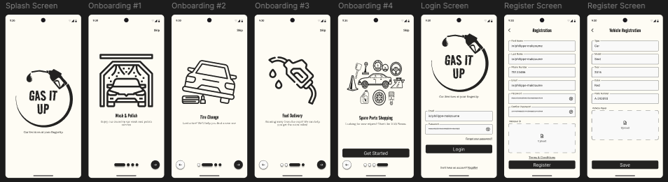
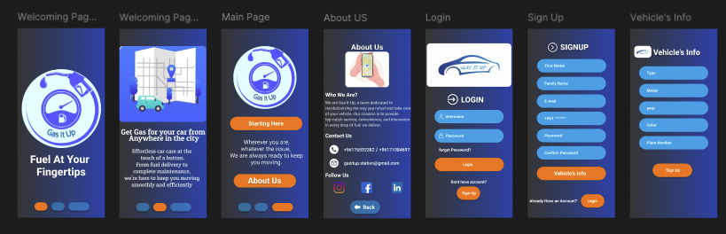

# Onboarding animation prototype

This project is a re-design of a client project and my first attempt at crafting modern and dynamic U.I with the use of animations such as Fade, Scale, Slide, and custom page transitions as well as resolving a common problem with the login page(s) on mobile which causes keyboard input to hide the submit button.

## Demo






## Installation Instructions

To run this project, follow these steps:

1.  Ensure you have Flutter Version Management (FVM) installed. If not, you can install it from [https://fvm.app/docs/getting_started/installation](https://fvm.app/docs/getting_started/installation).
2.  Use Flutter version 3.29.3 by running:

    ```bash
    fvm use 3.29.3
    ```

3.  Get the project dependencies:

    ```bash
    fvm flutter pub get
    ```

4.  Run the project on a connected device using its device ID:

    ```bash
    fvm flutter run -d (deviceId)
    ```

    Alternatively, you can use `F5` in VS Code to run the project.
